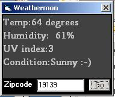

<div align="center">

## Weather\.com Parser


</div>

### Description

This is a program to get the Local weather status with information provided from weather.com It is very simple and not much error proofing but it does teach you opening a webpage for reading, string manipulation and using the timer. This took me about an hour. Note it only works for US zipcodes.
 
### More Info
 
You need to make a a textbox and name it area.text. You also need a commandbutton, the Internet Transfer Control, and a timer. Thats it.

Only works for US zipcodes, i think.

You need to make a a textbox and name it area.text. You also need a commandbutton, the Internet Transfer Control, and a timer. Thats it.


<span>             |<span>
---                |---
**Submitted On**   |
**By**             |[David Alexander](https://github.com/Planet-Source-Code/PSCIndex/blob/master/ByAuthor/david-alexander.md)
**Level**          |Intermediate
**User Rating**    |3.0 (12 globes from 4 users)
**Compatibility**  |VB 5\.0, VB 6\.0
**Category**       |[String Manipulation](https://github.com/Planet-Source-Code/PSCIndex/blob/master/ByCategory/string-manipulation__1-5.md)
**World**          |[Visual Basic](https://github.com/Planet-Source-Code/PSCIndex/blob/master/ByWorld/visual-basic.md)
**Archive File**   |[](https://github.com/Planet-Source-Code/david-alexander-weather-com-parser__1-66726/archive/master.zip)

### API Declarations

Dim data as string


### Source Code

```
(c)2006 by David Alexander
'I had fun writing this and learning, hopefully you can learn something too.
'If youd decide to use any parts of it please mention me, thanks.
'I know I could have cleaned up this code more but I just wanted to do something simple.
Dim data As String 'Declare the data file as string
Private Sub Command1_Click()
If area.Text = "" Then 'if the textbox is clear
MsgBox ("You need to Input a Zip code") 'tell them you need a zip code.
GoTo hell: 'error checking
End If
data = Inet1.OpenURL("http://www.weather.com/outlook/recreation/outdoors/local/" & area.Text & "&" & "?lswe=" & area.Text & "&" & _
"lwsa=Weather36HourOutdoorsCommand&from=whatwhere") 'sets the data variable as the the website we are going to pass
Parse (data) 'Call the Parse Function
hell: 'on error do nothing
End Sub
Private Sub Form_Load()
Timer1.Enabled = True 'Enable the timer so it checks the website every 2 minutes
End Sub
Private Function Parse(dat1 As String)
Dim lngA As Long 'dim all the start positions of the data we want to pass
Dim lngB As Long
Dim lngC As Long
Dim lngD As Long
lngD = InStr(1, data, "&humid=") + 7 'this is basically looking for the start of &humid= in the data file, as u may guess it will be the humidity
lngC = InStr(1, data, "&cond=") + 6
lngA = InStr(1, data, "temp=") 'looking for the temp...
lngB = InStr(1, data, "uv=")
cond = Mid(data, lngC, 5) 'This gets the "cloudy,"rainy" text etc; I wanted to change it so...
If cond = "cloud" Then 'if it says "cloud" replace it with the world "Cloudy :-("
cond = "Cloudy :-("
End If
If cond = "clear" Then 'if it says "clear" replace it with the word "Sunny :-)"
cond = "Sunny :-)"
End If
Label1.Caption = "Temp:" & Mid(data, lngA + 5, 2) & " degrees" & _
vbCrLf & "Humidity: " & Mid(data, lngD, 2) & "%" & vbCrLf & "UV index:" & Mid(data, lngB + 3, 1) & vbCrLf & _
"Condition:" & cond 'this looks complicated but it is not. Basically the Mid command gets all data between a start and end point. Those being lngA, lngB etc;
End Function
Private Sub Timer1_Timer()
data = Inet1.OpenURL("http://www.weather.com/outlook/recreation/outdoors/local/" & area.Text & "&" & "?lswe=" & area.Text & "&" & "lwsa=Weather36HourOutdoorsCommand&from=whatwhere")
Parse (data)
End Sub
```

